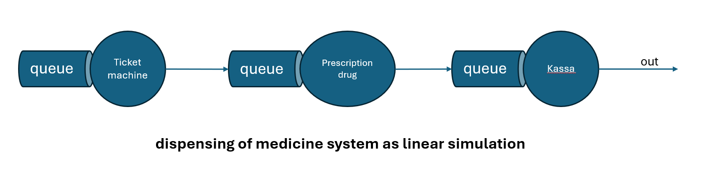
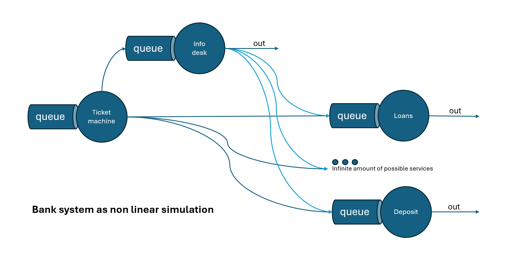

# Performance Measures and System Design Tasks

## 1. Discussion of Performance Measures in Real-World Terms

### Example Case: Bank Service System

#### Metrics:
- **A (Arrived Clients Count):** Represents the total number of customers entering the bank during the simulation period.
    - **Example:** If the bank opens at 9 AM and closes at 5 PM, and 150 customers enter during this period, then `A = 150`.

- **C (Clients Serviced Count):** Indicates how many customers complete their transactions (e.g., deposits, withdrawals) and leave.
    - **Example:** Out of the 150 customers who entered, 140 completed their transactions by 5 PM. Thus, `C = 140`.

- **B (Active Time in Service Point):** Tracks the total time bank tellers are actively serving customers.
    - **Example:** If three tellers are working and each spends 5 hours serving customers, the total active time is `B = 3 x 5 = 15 hours`.

- **T (Total Simulation Time):** Covers the entire simulation period, from when the bank opens to when it closes.
    - **Example:** If the bank operates for 8 hours, `T = 8 hours`.

#### Derived Metrics:
- **U (Utilization):** Measures teller efficiency as `U = B / T`. A high value indicates heavy teller usage.
    - **Example:** If `B = 15 hours` and `T = 8 hours`, then `U = 15 / 8 = 1.875`, meaning tellers were over-utilized.

- **X (Throughput):** Indicates service efficiency as `X = C / T`, showing how many customers are served per unit time.
    - **Example:** If `C = 140` and `T = 8 hours`, then `X = 140 / 8 = 17.5 customers per hour`.

- **S (Service Time):** Average time a teller spends per customer, calculated as `S = B / C`.
    - **Example:** If `B = 15 hours` and `C = 140`, then `S = 15 / 140 ≈ 0.107 hours` or about `6.43 minutes per customer`.

#### Additional Metrics:
- **Rᵢ (Response Time):** For each customer, the time taken from joining the queue to completing their transaction.
    - **Example:** A customer arrives at 10:00 AM, joins the queue, and completes the transaction at 10:15 AM. Their `Rᵢ = 15 minutes`.

- **W (Waiting Time):** Summed response times for all customers, reflecting the total delay experienced.
    - **Example:** If the response times of all 140 served customers sum up to 35 hours, then `W = 35 hours`.

- **R (Average Response Time):** Average customer delay: `R = W / C`.
    - **Example:** If `W = 35 hours` and `C = 140`, then `R = 35 / 140 = 0.25 hours` or `15 minutes`.

- **N (Average Queue Length):** Average number of customers in the queue and being served: `N = W / T`.
    - **Example:** If `W = 35 hours` and `T = 8 hours`, then `N = 35 / 8 = 4.375`, meaning an average of about 4-5 customers were in the system.

## 2. Performance Measures Categorization (W)

### Categories:
#### 1. **Service Point-Level Metrics**
These metrics track the performance and usage of individual service points (e.g., tellers in a bank, doctors in a clinic).

- **B (Active Time in Service Point):**
    - **Example:** In a hospital emergency department, the total time a doctor spends attending to patients during their shift.
    - **Key Insight:** This helps determine the workload of service providers and whether more resources are needed.

- **U (Utilization):**
    - **Example:** A grocery store cashier has a utilization rate of 80%, meaning they spend 80% of their shift actively scanning items for customers.
    - **Key Insight:** High utilization may indicate efficient usage but also potential overwork, leading to burnout.

- **S (Service Time):**
    - **Example:** In a call center, the average time spent on each customer call is 5 minutes.
    - **Key Insight:** Service time helps assess whether a service point is operating efficiently or if delays are expected.

#### 2. **Customer-Level Metrics**
These metrics measure the experience of individual customers in the system.

- **Rᵢ (Response Time):**
    - **Example:** In a fast-food restaurant, a customer spends 3 minutes in the queue and 2 minutes placing their order, leading to a response time of 5 minutes.
    - **Key Insight:** Long response times may indicate bottlenecks in the system.

- **W (Waiting Time):**
    - **Example:** In a government office, customers cumulatively spend 2 hours waiting in line before being served.
    - **Key Insight:** Long waiting times negatively affect customer satisfaction.

- **R (Average Response Time):**
    - **Example:** At a car wash, each customer’s response time averages to 15 minutes.
    - **Key Insight:** This provides an overall view of customer delays in the system.

#### 3. **System-Level Metrics**
These metrics provide an overview of the entire system's performance.

- **A (Arrived Clients Count):**
    - **Example:** A theme park records 500 visitors entering the park over a day.
    - **Key Insight:** This indicates the volume of demand on the system.

- **C (Clients Serviced Count):**
    - **Example:** In a doctor's office, 45 out of 50 patients received treatment in a day.
    - **Key Insight:** This shows how much of the demand was successfully handled.

- **X (Throughput):**
    - **Example:** A coffee shop serves 120 customers in 6 hours, leading to a throughput of 20 customers per hour.
    - **Key Insight:** High throughput indicates efficiency in serving customers.

- **N (Average Queue Length):**
    - **Example:** A ticket booth has an average of 5 people in line at any given time during peak hours.
    - **Key Insight:** This indicates the system's congestion and potential delays.

---

## 3. Two Real-World Systems Design (W)

### System 1: Dispensing of medicine

### System 2: Bank reception

## 4.

## Algorithm Steps

### 1. Initialize the System
- Set up all entities (e.g., operators, customers, resources).
- Define the event list (B-events and C-events).
- Initialize the current simulation time to zero.

### 2. Main Loop
The main loop runs until the termination condition is met (e.g., simulation time reaches a set limit or all events are processed). In each iteration, the following steps are executed.

#### a. Event Handling
1. **Sort and Retrieve the Next Event:**
    - Determine the next event based on the earliest time in the event queue (priority queue, sorted list, etc.).
    - Set the simulation time to the time of the next event.

2. **Process B-Event (Bound or Booked Event):**
    - B-events are scheduled state changes, such as customer arrivals, task completions, etc.
    - For each B-event:
        - **Update System State:** Change the state of the system according to the event (e.g., an operator becomes free after completing a task).
        - **Schedule Future B-Events:** If applicable, schedule the next B-event for that entity (e.g., schedule a customer's service completion).

3. **Check for Conditional Events (C-Events):**
    - C-events depend on system conditions (e.g., an operator can only start serving a customer if there is a customer waiting).
    - Evaluate the current state of the system to check if any C-events can be triggered:
        - **If C-event is possible:** Trigger the event and update the state accordingly (e.g., an operator starts serving a customer).
        - **Schedule Future C-events:** If applicable, schedule any follow-up C-events (e.g., the end of the service).

#### b. Termination Check
- After processing all events for the current iteration, check whether the simulation should end.
- If not, continue to the next event.